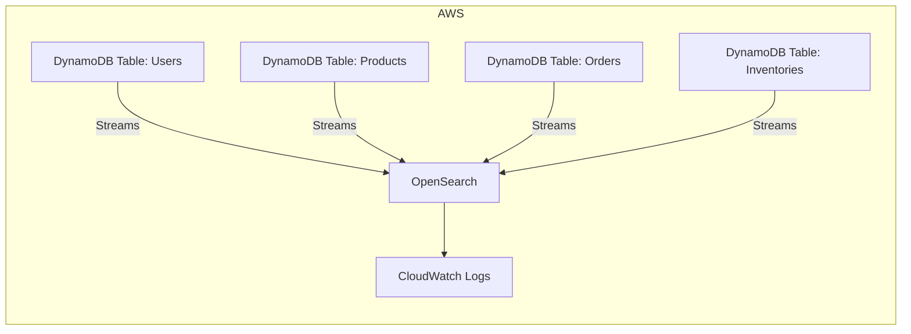

# DynamoDB Change Data Capture (CDC) to OpenSearch using Terraform

This project provides a streamlined solution for implementing Change Data Capture (CDC) from DynamoDB to OpenSearch.

By capturing and storing these changes, this project helps maintain operational visibility, especially during high traffic or potential DynamoDB throttling events, ensuring data consistency and faster query capabilities when performance matters most.

This setup uses Terraform to build a simple AWS stack with DynamoDB and OpenSearch. There are two DynamoDB tables: one for users and one for grocery products, both encrypted with KMS and configured with streams to pipe changes into OpenSearch.

 OpenSearch is set up with a minimal instance type (t3.small.search) to keep costs low, and everything’s locked down with IAM roles for secure access. It’s a straightforward way to get searchable, real-time data ingestion for lightweight applications or testing.

## Overview diagram



## Sample data to DynamoDB using AWSCurl

```
python3 -m venv .venv

source .venv/bin/activate

pip install awscurl

(add credentials to default in ~/.aws/credentials)
```

Add a user

```
awscurl --region eu-west-1 --service dynamodb \
  -X POST "https://dynamodb.eu-west-1.amazonaws.com" \
  -H "Content-Type: application/x-amz-json-1.0" \
  -H "X-Amz-Target: DynamoDB_20120810.PutItem" \
  -d '{
      "TableName": "users",
      "Item": {
          "id": {"S": "user123"},
          "email": {"S": "user123@example.com"}
      }
  }'
```

Update the user

```
awscurl --region eu-west-1 --service dynamodb \
  -X POST "https://dynamodb.eu-west-1.amazonaws.com" \
  -H "Content-Type: application/x-amz-json-1.0" \
  -H "X-Amz-Target: DynamoDB_20120810.UpdateItem" \
  -d '{
      "TableName": "users",
      "Key": {
          "id": {"S": "user123"}
      },
      "UpdateExpression": "SET email = :newEmail",
      "ExpressionAttributeValues": {
          ":newEmail": {"S": "updated_user123@example.com"}
      }
  }'
```

Delete the user

```
awscurl --region eu-west-1 --service dynamodb \
  -X POST "https://dynamodb.eu-west-1.amazonaws.com" \
  -H "Content-Type: application/x-amz-json-1.0" \
  -H "X-Amz-Target: DynamoDB_20120810.DeleteItem" \
  -d '{
      "TableName": "users",
      "Key": {
          "id": {"S": "user123"}
      }
  }'
```


## Estimated cost

```
 Name                                                   Monthly Qty  Unit                    Monthly Cost

 aws_opensearch_domain.example_domain
 ├─ Instance (on-demand, t3.small.search)                     2,190  hours                         $85.41
 └─ Storage (gp2)                                                20  GB                             $2.98

 aws_kms_key.cloudwatch_logs
 ├─ Customer master key                                           1  months                         $1.00
 ├─ Requests                                      Monthly cost depends on usage: $0.03 per 10k requests
 ├─ ECC GenerateDataKeyPair requests              Monthly cost depends on usage: $0.10 per 10k requests
 └─ RSA GenerateDataKeyPair requests              Monthly cost depends on usage: $0.10 per 10k requests

 aws_kms_key.dynamo_db_kms
 ├─ Customer master key                                           1  months                         $1.00
 ├─ Requests                                      Monthly cost depends on usage: $0.03 per 10k requests
 ├─ ECC GenerateDataKeyPair requests              Monthly cost depends on usage: $0.10 per 10k requests
 └─ RSA GenerateDataKeyPair requests              Monthly cost depends on usage: $0.10 per 10k requests

 aws_cloudwatch_log_group.opensearch_logs
 ├─ Data ingested                                 Monthly cost depends on usage: $0.57 per GB
 ├─ Archival Storage                              Monthly cost depends on usage: $0.03 per GB
 └─ Insights queries data scanned                 Monthly cost depends on usage: $0.0057 per GB

 aws_dynamodb_table.products_table
 ├─ Write request unit (WRU)                      Monthly cost depends on usage: $0.0000014135 per WRUs
 ├─ Read request unit (RRU)                       Monthly cost depends on usage: $0.000000283 per RRUs
 ├─ Data storage                                  Monthly cost depends on usage: $0.28 per GB
 ├─ Point-In-Time Recovery (PITR) backup storage  Monthly cost depends on usage: $0.22 per GB
 ├─ On-demand backup storage                      Monthly cost depends on usage: $0.11 per GB
 ├─ Table data restored                           Monthly cost depends on usage: $0.17 per GB
 └─ Streams read request unit (sRRU)              Monthly cost depends on usage: $0.000000226 per sRRUs

 aws_dynamodb_table.users_table
 ├─ Write request unit (WRU)                      Monthly cost depends on usage: $0.0000014135 per WRUs
 ├─ Read request unit (RRU)                       Monthly cost depends on usage: $0.000000283 per RRUs
 ├─ Data storage                                  Monthly cost depends on usage: $0.28 per GB
 ├─ Point-In-Time Recovery (PITR) backup storage  Monthly cost depends on usage: $0.22 per GB
 ├─ On-demand backup storage                      Monthly cost depends on usage: $0.11 per GB
 ├─ Table data restored                           Monthly cost depends on usage: $0.17 per GB
 └─ Streams read request unit (sRRU)              Monthly cost depends on usage: $0.000000226 per sRRUs

 OVERALL TOTAL                                                                                    $90.39

*Usage costs can be estimated by updating Infracost Cloud settings, see docs for other options.

──────────────────────────────────
11 cloud resources were detected:
∙ 6 were estimated
∙ 5 were free

┏━━━━━━━━━━━━━━━━━━━━━━━━━━━━━━━━━━━━━━━━━━━━━━━━━━━━┳━━━━━━━━━━━━━━━┳━━━━━━━━━━━━━┳━━━━━━━━━━━━┓
┃ Project                                            ┃ Baseline cost ┃ Usage cost* ┃ Total cost ┃
┣━━━━━━━━━━━━━━━━━━━━━━━━━━━━━━━━━━━━━━━━━━━━━━━━━━━━╋━━━━━━━━━━━━━━━╋━━━━━━━━━━━━━╋━━━━━━━━━━━━┫
┃ main                                               ┃           $90 ┃           - ┃        $90 ┃
┗━━━━━━━━━━━━━━━━━━━━━━━━━━━━━━━━━━━━━━━━━━━━━━━━━━━━┻━━━━━━━━━━━━━━━┻━━━━━━━━━━━━━┻━━━━━━━━━━━━┛
```


